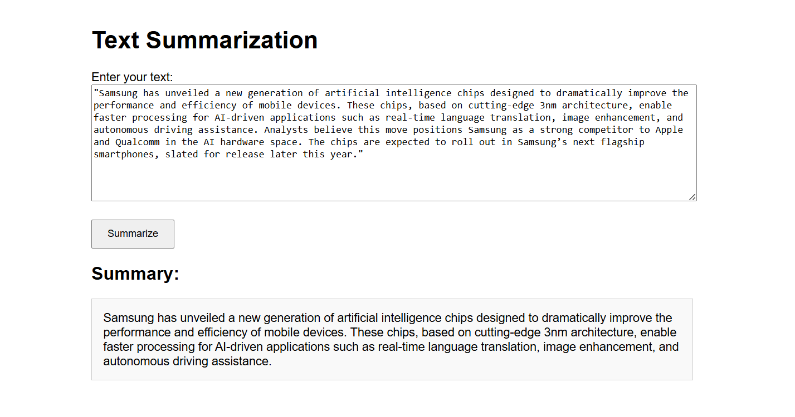

# 📝 Text Summarization with Facebook BART

This project performs **abstractive text summarization** using the **Facebook BART** model from Hugging Face. It includes a complete training pipeline on the SAMSum dataset and a Flask-based web interface for real-time prediction.

---

## 🚀 Features

- 📚 Trained on the [SAMSum dataset](https://huggingface.co/datasets/samsum)
- 🤖 Uses `facebook/bart-base` model from Hugging Face Transformers
- 🧪 Modular training pipeline with stages:
  - Data ingestion
  - Data validation
  - Data transformation
  - Model training
  - Model evaluation
- 🌐 Web interface for user-friendly summarization via Flask
- 🖥️ CPU-friendly setup (no GPU required)

---

## 🗂️ Project Structure
text-summarization/
│
├── src/
│ ├── components/ # Data ingestion, transformation, training, etc.
│ ├── pipeline/ # Prediction pipeline
│ ├── configuration.py # Config management
| ├── exception.py
│ ├── logger.py
| ├── constant.py
| ├── entity.py
│ └── utils.py
│
├── artifacts/ # Saved datasets, models, logs
├── templates/
│ └── index.html # Web interface (Flask)
├── app.py # Flask web app for prediction
├── paras.yaml
├── template.py
├── setup.py
├── requirements.txt
├── main.py # Script to run full training pipeline
├── config.yaml # Training and model config
└── README.md # This file

## 📸 Demo

Here’s what the summarization web interface looks like:

